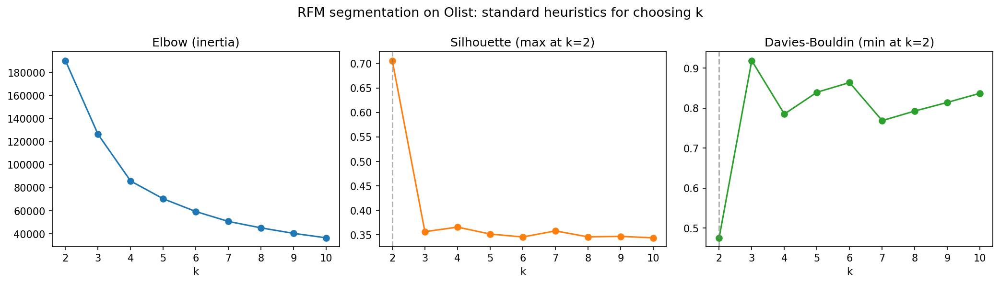

# How many customer segments are actually real?

I'm validating customer segmentation on real e-commerce data: classical
heuristics (elbow, silhouette, Davies-Bouldin) and SpecialK (Hess & Duivesteijn, ECML/PKDD 2019).

> **Work in progress.** Independent summer research project, July–August 2026.
> Everything below is from a first MVP and holds per-dataset, per-preprocessing,
> per-subsample. None of it is a general claim about RFM.

## The question

RFM (Recency, Frequency, Monetary) clustered with k-means is how industry
segments customers, and a heuristic like silhouette is what picks the number of
segments k. The catch: heuristics can only rank candidate k's against each
other. They can't tell you there are no real clusters at all. So — on real
data, how many segments can I actually *certify*, and do the heuristics and a
statistical test agree?

## Data

[Olist Brazilian e-commerce](https://www.kaggle.com/datasets/olistbr/brazilian-ecommerce)
— ~100k orders, 2016–2018. Not committed here; download from Kaggle and unzip
into `data/` next to the scripts.

Two things drive everything downstream:

- `customer_id` is unique **per order**. `customer_unique_id` is the actual
  person, so every aggregation happens there (~93,357 customers once I keep
  delivered orders only).
- **97.0% of customers bought exactly once**, so frequency is nearly a constant
  column. That's not a defect in the data — it's the regime where RFM actually
  gets deployed.

## Run it

```bash
pip install -r requirements.txt
# download Olist from Kaggle and unzip into data/
python rfm_baseline_mvp.py  # heuristics, saves rfm_heuristics.png
python specialk_olist.py    # statistical test, a few minutes
```

Seeds fixed at 42; silhouette on a 10k subsample (it's O(n²)).

## Scripts

- `rfm_baseline_mvp.py` — builds RFM per customer (log1p on frequency and monetary,
  then StandardScaler), runs k-means for k = 2..10, prints elbow, silhouette,
  and Davies-Bouldin.
- `specialk_olist.py` — rebuilds the exact same features, subsamples 10k
  customers (seed 42), and runs the authors' SpecialK. `getY`, `logZZTop`,
  `specialK`, and `get_W_cut` are copied **verbatim** from
  [Sibylse/SpecialK](https://github.com/Sibylse/SpecialK) (imports and
  whitespace only) so that "I ran the authors' code" stays literally true.

## What I've found so far (first MVP, July 2026)

On this dataset, under this preprocessing:

1. **The heuristics certify an artifact.** They agree on k = 2 (silhouette
   0.706, Davies-Bouldin 0.476) — but the two "segments" are exactly
   `frequency == 1` vs `frequency > 1` (90,556 vs 2,801 customers, zero
   crossover). log1p + StandardScaler on a 97%-constant column stretches the
   frequency axis far past recency and monetary, so Euclidean k-means splits on
   it and nothing else.
2. **Drop frequency → the structure is gone.** Recency + monetary only:
   silhouette flat at 0.32–0.36 for every k in 2..10, no preferred value.
3. **SpecialK refuses everything.** 10k subsample, α = 0.01, kNN cut similarity
   matrix, 200 eigenvectors: k = 1 for both full RFM and recency+monetary. The
   bound at r = 2 isn't marginally above α — it's vacuous.

Short version: *under the standard pipeline the heuristics unanimously certify
a k = 2 segmentation that's a deterministic artifact of a degenerate feature,
while the statistical test refuses to certify anything at all.*



**Caveats I'm keeping open.** SpecialK's published experiments run on spectral
embeddings of similarity graphs; mine are 3-dimensional raw RFM. Whether the
bound even means anything in that low-dimensional raw-feature regime is an open
question that will be further explored. Independent benchmarks
also report SpecialK errs conservative, toward fewer clusters. Until that's
settled I'm holding both readings of the k = 1 verdict.

## Where this is going

Preprocessing sensitivity (does the "optimal" k move when I change the scaler?),
a two-regime design (full population vs repeat buyers, sweeping subsample size),
an LLM-embedding representation arm with dimensionality controls, and a fuller
validation battery (gap statistic, stability analysis).

## References

- S. Hess & W. Duivesteijn, *k is the Magic Number — Inferring the Number of
  Clusters Through Nonparametric Concentration Inequalities*, ECML/PKDD 2019.
  [arXiv:1907.02343](https://arxiv.org/abs/1907.02343) ·
  [official implementation](https://github.com/Sibylse/SpecialK)
- Olist, *Brazilian E-Commerce Public Dataset*,
  [Kaggle](https://www.kaggle.com/datasets/olistbr/brazilian-ecommerce)
